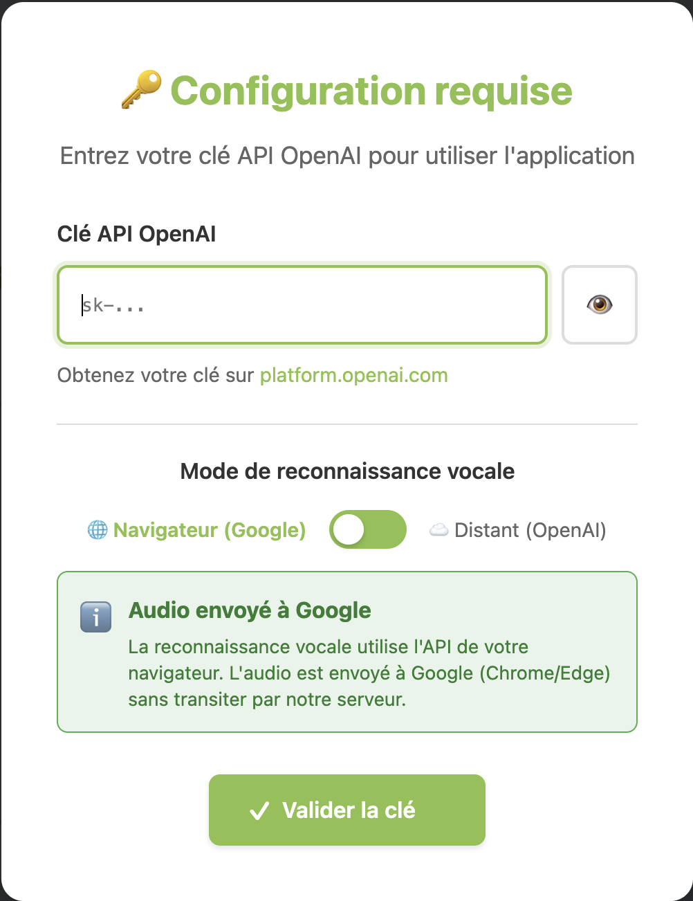
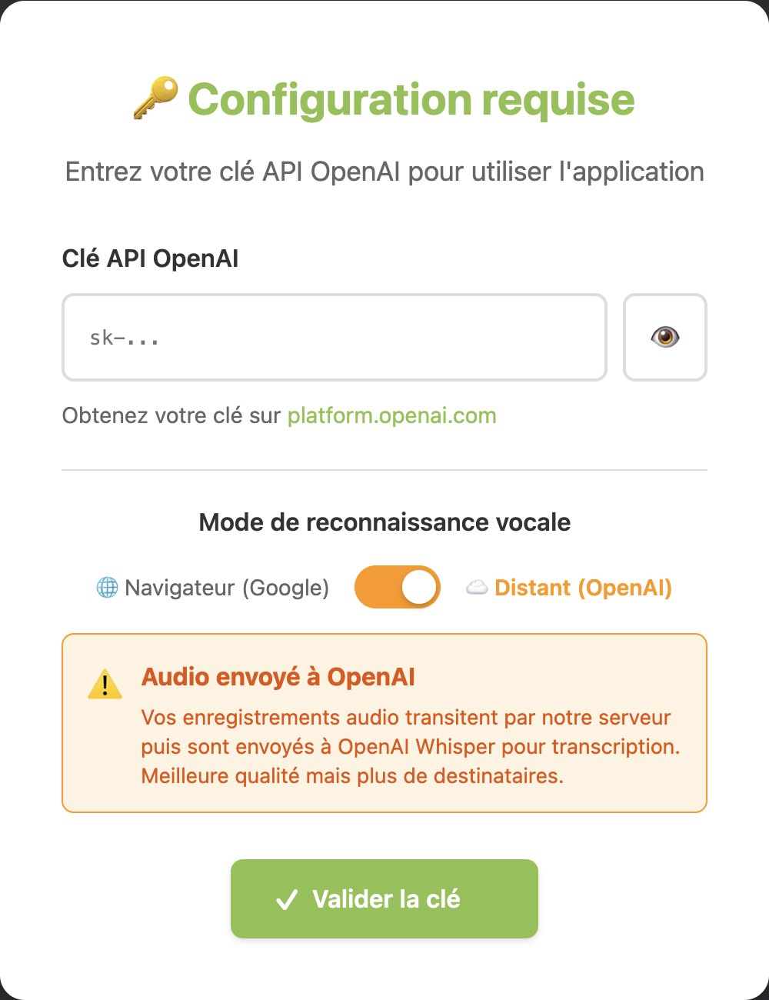

# Générateur GEVA-Sco pour CP

## 📋 Description

Outil interactif pour faciliter et accélérer le remplissage des documents GEVA-Sco (Guide d'Évaluation des besoins de compensation en matière de Scolarisation) pour les élèves de CP.

## ✨ Fonctionnalités principales

### 1. **Formulaire interactif complet**
- Tous les champs nécessaires pour un GEVA-Sco
- Interface claire et organisée par sections
- Validation automatique des données

### 2. **Bibliothèque de phrases types**
- Plus de 100 phrases pré-rédigées adaptées au niveau CP
- Catégories: comportement, français, mathématiques, autonomie, besoins, aménagements
- Insertion en un clic dans les champs correspondants
- Formulations professionnelles et conformes aux attentes

### 3. **Génération PDF automatique**
- Création d'un PDF professionnel en un clic
- Mise en forme respectant la structure officielle
- Nom de fichier automatique avec le nom de l'élève et la date

### 4. **Sauvegarde automatique**
- Sauvegarde locale dans le navigateur
- Auto-sauvegarde toutes les 30 secondes
- Récupération des données en cas de fermeture accidentelle
- Bouton de sauvegarde manuelle

### 5. **Gestion du parcours**
- Ajout/suppression de lignes pour le parcours de scolarisation
- Historique complet des années précédentes

## 🚀 Utilisation

### Lancement de l'application

1. Ouvrez le fichier `index.html` dans votre navigateur web
2. L'application se charge automatiquement

### Remplir un GEVA-Sco

#### Méthode 1: Saisie manuelle
1. Remplissez les champs du formulaire section par section
2. Les données sont sauvegardées automatiquement

#### Méthode 2: Avec les suggestions (recommandé)
1. Remplissez les informations administratives (élève, parents, école)
2. Pour les observations pédagogiques, cliquez sur les suggestions proposées
3. Les phrases s'insèrent automatiquement dans les bons champs
4. Personnalisez ensuite selon les besoins spécifiques de l'élève

### Générer le PDF

1. Vérifiez que tous les champs nécessaires sont remplis
2. Cliquez sur **"Générer le PDF"** (bouton orange en haut à droite)
3. Le PDF se télécharge automatiquement
4. Le fichier est nommé: `GEVA-Sco_NOM_Prenom_2025-01-18.pdf`

### Sauvegarder / Charger

- **Sauvegarde manuelle**: Bouton vert "Sauvegarder"
- **Auto-sauvegarde**: Toutes les 30 secondes automatiquement
- **Chargement**: Automatique à l'ouverture de la page

### Réinitialiser

- Bouton "Réinitialiser le formulaire" (jaune)
- Efface toutes les données après confirmation

## 📚 Bibliothèque de phrases types

### Catégories disponibles

#### **Comportement**
- Adaptation au cadre scolaire
- Attention et concentration
- Relations avec les pairs
- Gestion des émotions

#### **Français**
- Reconnaissance des lettres
- Décodage et lecture
- Écriture et graphisme
- Compréhension orale

#### **Mathématiques**
- Comptine numérique
- Dénombrement
- Calcul mental
- Formes géométriques

#### **Autonomie**
- Gestion du matériel
- Organisation du travail
- Sollicitation de l'adulte

#### **Besoins identifiés**
- Enseignement explicite
- Supports visuels
- Temps supplémentaire
- Accompagnement individualisé

#### **Aménagements proposés**
- Matériel adapté
- Place dans la classe
- Adaptations pédagogiques
- Interventions spécialisées (AESH, RASED)
- Bilans complémentaires

## 💡 Conseils d'utilisation

### Pour gagner du temps

1. **Commencez par les suggestions**: Parcourez les phrases types et sélectionnez celles qui correspondent
2. **Personnalisez ensuite**: Ajustez les phrases avec des exemples concrets
3. **Utilisez la sauvegarde**: Travaillez en plusieurs fois, vos données sont conservées
4. **Dupliquez pour plusieurs élèves**: Remplissez un premier GEVA-Sco, générez le PDF, puis modifiez pour l'élève suivant

### Structure recommandée

Pour chaque section d'observation:
1. Commencez par les **points positifs** (ce que l'élève sait faire)
2. Identifiez les **difficultés** rencontrées
3. Proposez des **aménagements** adaptés

### Formulations professionnelles

Les phrases de la bibliothèque utilisent:
- Le présent de l'indicatif
- Un vocabulaire précis et professionnel
- Des formulations positives quand c'est possible
- Des observations factuelles

## 🔧 Fonctionnalités techniques

### Compatibilité
- Fonctionne sur tous les navigateurs modernes (Chrome, Firefox, Safari, Edge)
- Responsive: utilisable sur ordinateur, tablette et smartphone
- Pas besoin de connexion Internet après le premier chargement

### Données
- Voir la section **Protection des données et RGPD** ci-dessous pour les détails complets

### Performance
- Application légère et rapide
- Génération PDF instantanée
- Pas de ralentissement même avec beaucoup de texte

## 🔒 Protection des données et RGPD

### Mode hors-ligne (formulaire seul)
- Données stockées localement dans votre navigateur (localStorage)
- Aucune donnée envoyée sur Internet
- Confidentialité totale des informations élèves

### Mode vocal (avec backend)

#### Choix du mode de reconnaissance vocale

L'application propose **deux modes de reconnaissance vocale** :

| Mode | Capture | Destinataire audio | Qualité |
|------|---------|-------------------|---------|
| 🌐 **Navigateur** |  | Google (Chrome/Edge) ou Apple (Safari) | ⭐⭐⭐ |
| ☁️ **Distant (OpenAI)** |  | OpenAI | ⭐⭐⭐⭐⭐ |

**Par défaut, le mode navigateur est activé.** L'audio ne transite pas par notre serveur applicatif, mais est traité par le service de reconnaissance vocale intégré à votre navigateur.

> ⚠️ **Important** : En mode "Navigateur", Chrome et Edge envoient l'audio aux serveurs Google pour la reconnaissance vocale. Safari utilise les serveurs Apple. **Aucun des deux modes n'est véritablement "local"** - la différence réside dans le choix du prestataire (Google/Apple vs OpenAI).

#### Compatibilité navigateurs (mode navigateur)

| Navigateur | Support | Destinataire des données |
|------------|---------|-------------------------|
| **Chrome** | ✅ Complet | Google |
| **Edge** | ✅ Complet | Google (via Chromium) |
| **Safari** | ⚠️ Partiel | Apple |
| **Firefox** | ❌ Non supporté | - |
| **Opera** | ✅ Complet | Google (via Chromium) |

> **Note** : Si votre navigateur ne supporte pas le mode navigateur, l'application bascule automatiquement en mode distant (OpenAI).

#### Données transmises selon le mode

| Fonction | Mode Navigateur | Mode Distant |
|----------|----------------|--------------|
| Transcription (STT) | Audio envoyé à Google/Apple | Audio envoyé à OpenAI |
| Enrichissement | Texte transcrit + contexte | Texte transcrit + contexte (identique) |
| Transit serveur applicatif | ❌ Non | ✅ Oui |

**Données potentiellement concernées :**
- Nom et informations de l'élève mentionnés oralement => ne jamais mentionner d'informations d'identité de l'élève lors de l'entretien vocal
- Observations comportementales et pédagogiques
- Difficultés d'apprentissage évoquées
- Tout autre contenu verbal

**Mesures de protection :**
- Les fichiers audio sont supprimés du serveur immédiatement après transcription
- Aucune donnée n'est stockée de façon permanente côté serveur
- Les échanges avec les API sont chiffrés (HTTPS)

**Rôle de l'IA :**
L'intelligence artificielle utilisée dans cet outil est uniquement un **assistant rédactionnel**. Aucune décision concernant la scolarité de l'élève ou les aménagements pédagogiques n'est prise par l'IA. **L'enseignant reste seul décisionnaire** de toutes les observations, analyses et préconisations inscrites dans le document GEVA-Sco.

**Configuration du provider :** Voir la variable `AI_PROVIDER` dans le fichier `.env`

## 📁 Structure du projet

```
Gevasco/
├── index.html              # Page principale
├── css/
│   └── styles.css         # Styles de l'application
├── js/
│   ├── app.js            # Logique principale
│   └── phrases-cp.js     # Bibliothèque de phrases
├── data/                  # (futur) Templates et exports
└── README.md             # Ce fichier
```

## 🎯 Avantages

### Gain de temps
- **Avant**: 45-60 minutes par GEVA-Sco
- **Avec l'outil**: 15-20 minutes par GEVA-Sco
- **Économie**: 60-70% de temps

### Qualité
- Formulations professionnelles
- Cohérence entre les documents
- Moins d'oublis grâce à la structure guidée

### Facilité
- Interface intuitive
- Suggestions contextuelles
- Pas de formation nécessaire

## 🔮 Évolutions futures possibles

- Phrases types pour d'autres niveaux (GS, CE1, CE2)

---

**Version**: 1.0
**Date**: Janvier 2026
**Licence**: Usage éducatif
